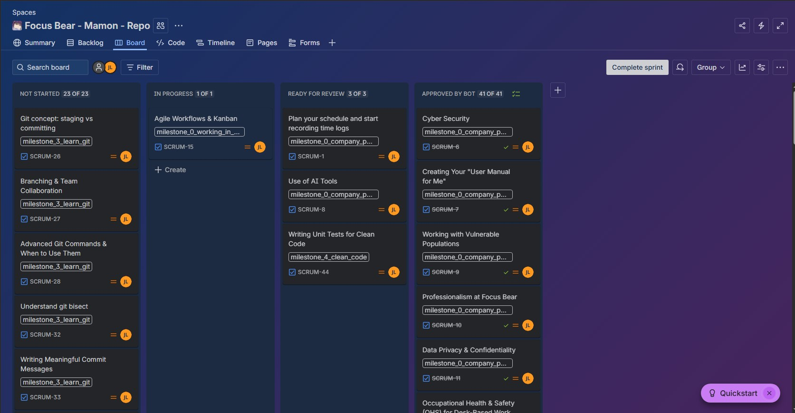

Jianna Monique M. Lucero

# Agile Workflows & Kanban

## Research & Learn

1. How does a Kanban board work, and how does it help manage workflow?

A Kanban board is defined as a visual project management tool that maps tasks, which are visualized as cards, onto columns representing different workflow stages. The typical workflow stages usually consist of “To Do," “In Progress,” and “Done,” and these stages are used to track progress from start to finish. A Kanban board can help manage workflow for a number of reasons. First, it can help better visualize the workflow, as it can provide transparency, allowing everyone to see who is doing what and where bottlenecks exist. It also helps identify bottlenecks as it can instantly highlight where the process is breaking down if tasks start piling up in a specific column. A Kanban board also increases efficiency as it focuses on finishing tasks instead of starting new ones, resulting in a team being able to complete work faster compared to not using a Kanban board. Lastly, by limiting the number of tasks allowed in a specific column, this can ensure that team members do not overcommit, improving both focus and the quality of work produced.

2. What do the different columns on a Kanban board represent? (e.g., Backlog, In Progress, Blocked, Done)

- Backlog

Represents new tasks, ideas, or requests that are planned but not yet started.

- In Progress

Represents tasks currently worked on by team members. To maintain focus and speed, teams often set Work-In-Progress (WIP) Limits on this column. This means that a developer shouldn’t start a new task until they finish their current task.

- Blocked

If a task cannot move forward because of an external issue, it is moved here.

- Done

Contains tasks that have successfully passed through all workflow stages and are finished

3. How do tasks move through the board, and who is responsible for updating them?

Tasks move through a Kanban board by traversing columns that represent specific stages of a workflow, moving from left to right as work progresses from “To Do” to “Done”. This movement is driven by a “pull system” wherein team members take ownership and move their own tasks, or pull new tasks if they have the capacity. However, in some setups, a specialized role (similar to a Scrum Master) ensures the board is maintained, bottlenecks are addressed, and that the team adheres to process policies.

4. What are the benefits of limiting work in progress (WIP)?

- Increased Speed and Throughput

By focusing on completing existing tasks instead of starting new ones, teams can deliver work faster

- Improved Quality and Focus

By limiting WIP, it can allow team members to concentrate on fewer items, reducing errors while improving the overall quality.

- Reduced Multitasking and Context Switching

With team members concentrating on fewer items, this allows them to stay focused, avoiding the inefficiencies caused by constantly switching between different tasks.

- Better Bottleneck Identification

With limits in place, it also helps in better identifying obvious areas where work is piling up, allowing teams to be able to address bottlenecks, which improves workflow efficiency.

- Enhanced Team Morale

Limiting WIP also prevents team members from feeling overloaded and overwhelmed, creating a more sustainable and predictable pace of work.

- Greater Flexibility and Responsiveness

Smaller batches of work can allow teams to be able to adapt quickly to changing priorities or customer needs.

## Reflection

1. How does Kanban help manage priorities and avoid overload?

Kanban helps manage priorities and avoid overload due to how they visualize tasks and its use of Work-in-Progress (WIP) limits. By mapping out and categorizing tasks onto different columns such as "In Progress" and "Backlog", the team is able to fully see their entire workflow. This also allows the Product Manager to be able to better prioritize the most valuable tasks by placing it at the top of the backlog, letting developers be aware of what to pull next and do. Meanwhile, using WIP limits protects team members being overwhelmed by the number of tasks needed to be done. It forces the team members to focus on finishing current tasks before starting new ones, eliminating the stress of multitasking.

2. How can you improve your workflow using Kanban principles?

I can improve my workflow using Kanban principles by first focusing on making small but manageable adjustments to my work routine instead of a large change to my routine and habits. I will use my existing work schedule as a basis and slowly integrate Kanban practices such as using a Kanban board in order to track my tasks and properly visualize my progress. I should also respect my current role as a developer and its responsibilities by being able to master and understand the tasks I'm given within my team's existing system. Lastly, I should be a proactive member of my team by speaking up whenever I notice a bottleneck or obstacle that is preventing me from completing my current task. By applying these improvements using Kanban principles, it would greatly improve my workflow as well.

## Tasks

Attached below is my Kanban board for my onboarding repository. I am using the Jira Website as my Kanban board and I will use this to track, monitor and update my progress for the tasks given to me during my onboarding program.

1. Identify one way you can improve task tracking in your role.

As a developer, I can improve task tracking by visualizing the specific technical stages of my coding workflow by using a Kanban board. This improvement allows me to see exactly where a task is stalled, whether I’m still doing my part or simply waiting for feedback from my superior, which helps me identify bottlenecks more quickly. By tracking these smaller movements, I gain better transparency over my daily progress and can communicate my status more clearly to the team without needing extra meetings.
