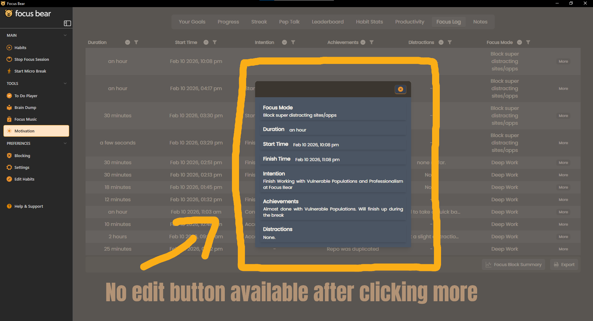
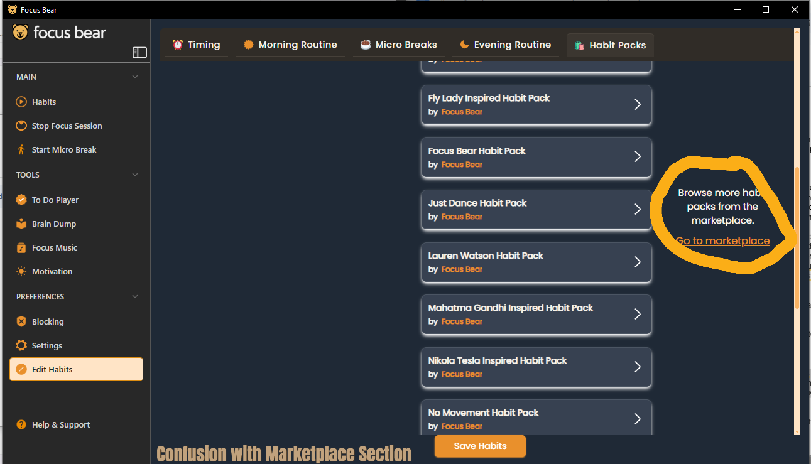
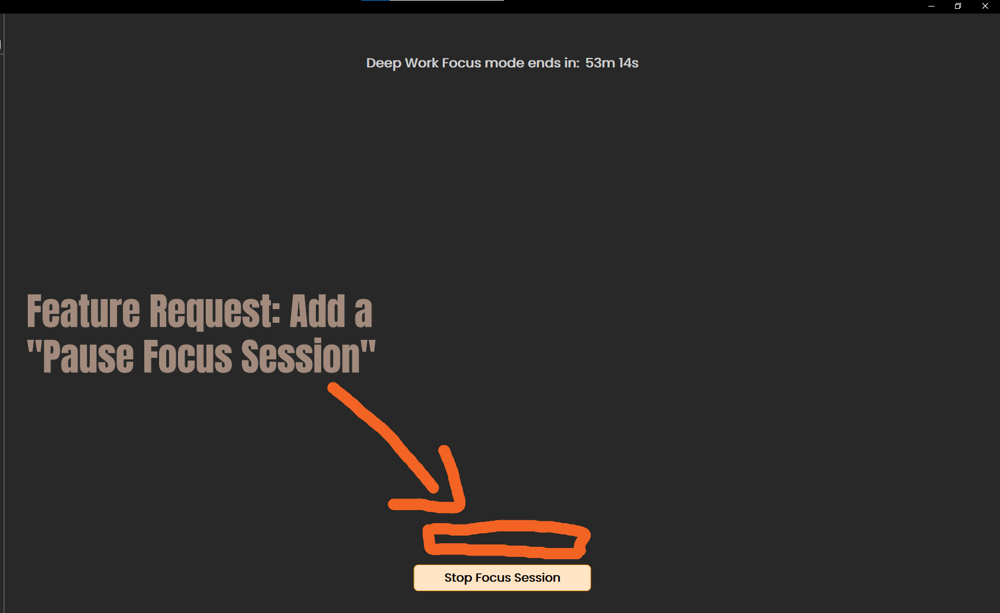
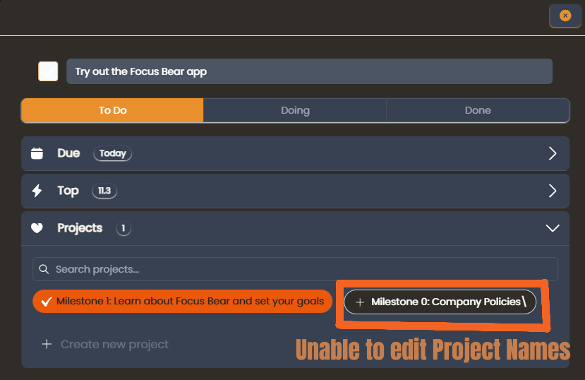
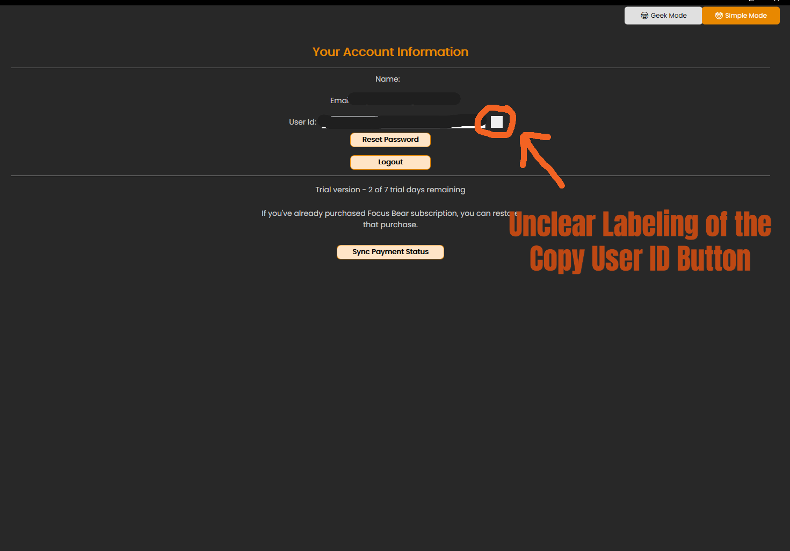

Jianna Monique M. Lucero

Using Focus Bear

1. Inability to edit Focus Logs

During the first few focus sessions, I make some mistakes occasionally, such as labeling an intention or achievement incorrectly or forgetting to set the timer correctly, and I would like to restart the session. However, after checking the Focus Log section to edit the details of my section or delete test sessions or sessions with the wrong timer, I realized that I am unable to edit them. 

If possible, there could be a button after clicking the more that says “Edit” which can allow me to either delete the session or edit its details such as intentions and achievements.

2. Marketplace Naming Convention

I was confused with the term marketplace when viewing more habit packs. I assumed that I needed to purchase the habit packs in order to use it. After checking each pack and seeing no purchase button, I was confused on whether they are already available in my app. When I also checked the pricing plan of Focus Bear, there’s no indication if the habit packs are part of the pro plan or the free plan.

If the packs in the marketplace are part of the free plan, maybe rename the term ‘Marketplace’ to either ‘Library’ or ‘Gallery’. If the packs are part of the pro plan, it should either be mentioned in the pricing plan or have an indicator on the marketplace that the habit packs are part of the pro plan.

3. Lack of a “Pause” Option During Focus Session

During a focus session, I observed that I am unable to pause a focus session. If ever I want to take a quick emergency bathroom break, I have no option to pause it. I either have to end the session early which could mess up my streak or let the timer run while I’m away from my device which might mess up my focus data.

Add a “Pause Session” button for short and quick breaks to maintain data accuracy. Maybe a prompt to ask the user why they would like to pause the session and maybe let AI determine if the reason is reasonable for the focus session to be paused. For the free plan, you could add a section under settings adding keywords or phrases that can be reasonable for pausing a focus session.

4. Unable to edit Project Names for Tasks

If I make a typo when adding a project, I am unable to delete it or edit the project name once I confirm it.

Provide an option to edit Project Names or delete them to have a more organize list of projects.

5. The Square Icon beside the User ID

For the desktop version, I observed that there is only a white square beside the user ID, and I was initially not sure what the icon was supposed to do. Now I know that it’s supposed to copy the user ID. It lacks any visual distinction that it’s supposed to copy the user ID.

Add labeling onto the square icon indicating that it’s supposed to copy the user ID.

