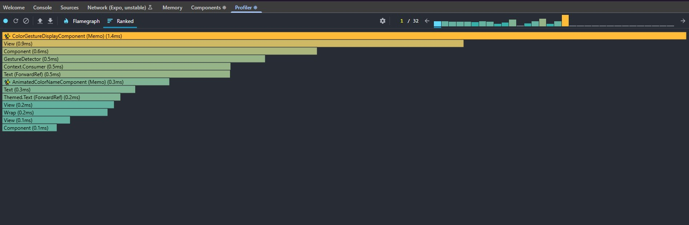

Jianna Monique M. Lucero

# Performance Optimization in React Native

## Optimize milestone10Project using useMemo, useCallback, and React.memo

### 1. **hooks/use-color-gestures.ts**

**Optimizations Applied:**

- Imported `useMemo` to memoize the return object
- Created `PALETTE_LENGTH` constant outside the hook to avoid repeated calculations
- Wrapped the return object in `useMemo` to ensure stable references

### 2. **app/api-demo.tsx**

**Optimizations Applied:**

- Imported `useCallback` and `useMemo`
- Wrapped `loadHabits` function in `useCallback`
- Wrapped `handleBack` function in `useCallback`
- Memoized `renderItem` callback for FlatList
- Memoized button styles with `useMemo`

### 3. **components/color-gesture-display.tsx**

**Optimizations Applied:**

- Imported `memo` and `useMemo`
- Wrapped gesture definitions (`panGesture`, `doubleTap`) in `useMemo`
- Memoized composed gesture with `useMemo`
- Wrapped entire component with `React.memo`

### 4. **components/animated-color-name.tsx**

**Optimizations Applied:**

- Imported `memo`
- Added proper TypeScript interface for props
- Wrapped component with `React.memo`

### 5. **components/data-item.tsx**

**Optimizations Applied:**

- Imported `memo`
- Wrapped component with `React.memo`

## Performance Results

### Testing with React DevTools Profiler

## Reflection

1. What are the most common performance issues in React Native?

- Unneccessary Re-renders
  This happens because the elements re-render even if the props or state have not been effectively modified.

- Inefficient List Handling
  Using a standard ScrollView for large sets of data can cause high memory usage because all items will be rendered at once.

- Heavy Computations on the Javascript (JS) Thread

JS thread execution is responsible for business logic execution, state changes, and API calls. If expensive operations like filtering large sets of data or performing complex calculations are executed in every render, they will block the execution of the JS thread. This will cause "stuttered" UI responsiveness.

- Image and Asset Optimization

High-resolution images without proper caching or resizing can cause high memory usage. In low-end devices, this can cause a problem because images are not optimized. This will result in the application taking a long time to load or will simply crash.

- Memory Leaks

If timers, subscriptions, or event listeners are not cleared in a component that has been unmounted, they will continue to consume resources in the background. After some time, this will cause major slowdowns in the application and will eventually cause the application to crash.

- Bridge and JSI Overhead

Frequent or high-volume communication between the JavaScript and Native threads can cause performance lag. Although this problem has been solved with the introduction of new architectures like JSI, high volumes of communication can still cause performance lag.

2. How do `useMemo` and `useCallback` improve performance?

useMemo and useCallback help optimize performance by storing computed results and function instances. This can help in reducing unnecessary and computationally expensive recalculations and renders of child components during the component lifecycle. useMemo is particularly designed to optimize "heavy" computation, such as data filtering, by storing the result in memory and recalculating the result only when the dependencies change, thus leaving the main thread free and maintaining a responsive UI. Furthermore, these two hooks also help ensure that objects, arrays, and functions remain the same in memory, thus preventing unnecessary execution in subsequent hooks such as useEffect or memoized components, thus maintaining a ensuring the UI of an app runs smoothly.

3. What tools can you use to measure and monitor app performance?

The primary method I would use to measure and monitor performance in React Native is the React Native DevTools Profiler, which can be accessed by pressing 'j' in my terminal while the app is running. This is a modern debugging tool that will allow me to record the performance of my component render, helping me pinpoint which component are re - rendering and how long those renders will take.
