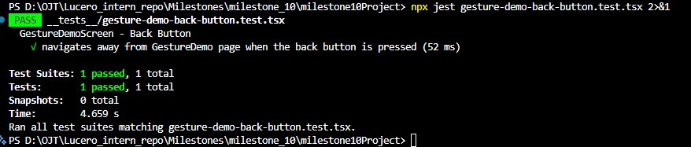
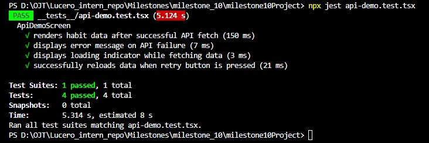

Jianna Monique M. Lucero

## Test for React Native Component

Created a file entitled `gesture-demo-back-button.test.tsx` to test the back button of the Gesture Demo screen. Attached below is the test command of the file:

## Test for Mock API Calls and Components for Data Fetching

Created a file entitled `api-demo.test.tsx` to test API-driven rendering in the API Demo screen. The tests cover successful data loading, error handling, loading state display, and retry behavior by mocking `fetchHabits` responses.

# Writing Unit and Integration Tests for React Native

1. Why is testing important in React Native development?

Testing is important in React Native development because it acts as a preventive measure to ensure that the code used in the application is of high quality, that bugs are detected early, and that the application is stable enough to cater to the needs of a growing number of users. This can be achieved through a mix of unit, integration, component, and end-to-end testing, which ensures that all functions in the application operate smoothly and seamlessly on both iOS and Android devices. By conducting testing, it not only enhances collaboration among developers but is also a critical requirement to ensure that the application is developed quickly and released in high quality, resulting in an increase in satisfaction of the users who interact with it.

2. How do you mock API calls in tests?

To mock API calls in tests, I use Jest mock functions such as `jest.fn()`, to mock the actual service functions and test the API call functionality without actually making the asynchronous calls. This is achieved by creating a manual mock for the API service module and using `jest.mock()` to intercept its import during test execution. Then, the result of the API call is controlled by using the mockResolvedValue() function, which provides the data fixtures for a successful API call, or the `mockRejectedValue()` function, which simulates the failure of the API call by providing mock data for the failure scenario. Furthermore, by using the helper functions, such as `mockFetchHabitsSuccess` and mockFetchHabitsFailure, the actual test code has been kept clean, and the functionality of the UI has been verified for different API call scenarios, such as success, failure, and retry, by using the utilities like waitFor for the asynchronous nature of the updates.

3. What's the difference between unit and integration tests?

The main difference between unit and integration tests lies in their scope and purpose. Unit tests check small pieces of code, and is usually an individual function or method. On the other hand, integration tests check the interaction of modules, components, and other systems like APIs and databases. While unit tests give instant and fast results during the development phase, integration tests are generally slower and more complicated. This is because they are considered a secondary test to catch errors that only appear during the interaction of separate components of the system. While unit tests check if the code was built correctly, integration tests check if the system works correctly.
