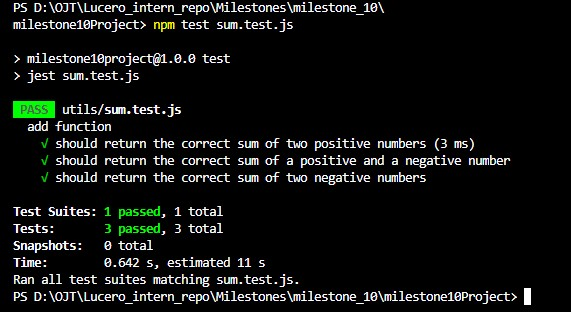
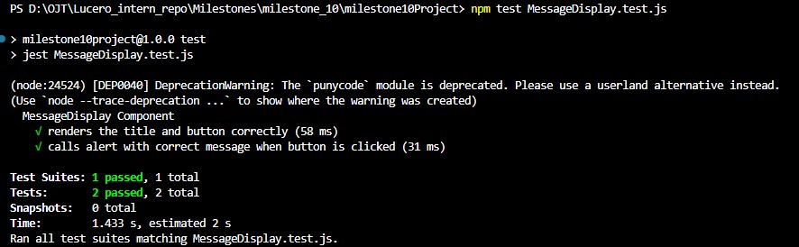

Jianna Monique M. Lucero

# Introduction to Unit Testing with Jest

## Sample Function

```javascript
export const add = (a, b) => {
  return a + b;
};
```

## Test File Containing Multiple Test Cases for Sample Function

```javascript
import { add } from './sum';

describe('add function', () => {
  it('should return the correct sum of two positive numbers', () => {
    const result = add(2, 3);
    expect(result).toBe(5);
  });

  it('should return the correct sum of a positive and a negative number', () => {
    const result = add(5, -2);
    expect(result).toBe(3);
  });

  it('should return the correct sum of two negative numbers', () => {
    const result = add(-4, -6);
    expect(result).toBe(-10);
  });
});
```

## Testing a Simple Utility Function



## Reflection

1. Why is automated testing important in software development?

Automated testing is important in software development because it not only guarantees that the code is correct but also guarantees the system's reliability. Furthermore, it also speeds up the process of software development. By using unit tests to ensure that the code behaves correctly in isolated situations and integration tests to ensure that the system behaves correctly in complex situations, developers are able to detect bugs in the system early in the process when they are easiest to fix. This not only makes it easier to refactor the code and design the system in modules but also makes it easier to document as it can explain how the system should behave. Ultimately, automated testing enables developers to move from repetitive testing to feature building, ensuring that the system not only behaves correctly but also scales well as it continues to grow.

2. What did you find challenging when writing your first Jest test?

While writing my first Jest test, what I found challenging was trying to configure and set up Jest correctly. In addition, this was my first time using Jest, so I had to understand its framework and how to use it when writing my first Jest test. However, after understanding its test structure such as using terms like `describe`, `test`, and `expect`, I was able to get a general flow on how to write my first Jest test. By using Jest to write a test for a simple sum function, I can be able to apply it on writing more complex tasks such as testing React/React Native components or mocking dependencies like conducting API calls.

# Testing React Components with Jest & React Testing Library

## Sample React Component that Displays a message

```javascript
import React from 'react';

export default function MessageDisplay() {
  const handlePress = () => {
    window.alert('Button has been Pressed');
  };

  return (
    <div>
      <h1>Testing React Components with Jest & React Testing Library</h1>
      <button type="button" onClick={handlePress}>
        Press Me
      </button>
    </div>
  );
}
```

## Test File Containing Multiple Test Cases for Sample Function

```javascript
/** @jest-environment jsdom */

import React from 'react';
import { render, screen } from '@testing-library/react';
import userEvent from '@testing-library/user-event';
import MessageDisplay from './MessageDisplay';

describe('MessageDisplay Component', () => {
  let alertSpy;

  beforeEach(() => {
    window.alert = window.alert || (() => {});
    alertSpy = jest.spyOn(window, 'alert').mockImplementation(() => {});
  });

  afterEach(() => {
    alertSpy.mockRestore();
  });

  test('renders the title and button correctly', () => {
    render(<MessageDisplay />);

    const title = screen.getByText(
      /Testing React Components with Jest & React Testing Library/i
    );
    const button = screen.getByRole('button', { name: /Press Me/i });

    expect(title).toBeTruthy();
    expect(button).toBeTruthy();
    expect(button.textContent).toBe('Press Me');
  });

  test('calls alert with correct message when button is clicked', async () => {
    render(<MessageDisplay />);
    const user = userEvent.setup();
    const button = screen.getByRole('button', { name: /Press Me/i });

    await user.click(button);

    expect(alertSpy).toHaveBeenCalledTimes(1);
    expect(alertSpy).toHaveBeenCalledWith('Button has been Pressed');
  });
});
```

## Testing the MessageDisplay Component



## Reflection

1. What are the benefits of using React Testing Library instead of testing implementation details?

- Resilience to Refactoring

If I rerrange my code and rename my variables, a "bad" test will fail since it consists of the test checking my code. By using RTL, the test doesn't care about my code and only cares if the user sees the same thing. This means that my tests will remain as pass even though I'm cleaning up my "messy" code.

- Increased User - Centric Confidence

By mimicking human behavior when interacting with my system, RTL gives me better confidence that my code will work when I put it in front of a real user. This is because RTL check the output that the user actually sees.

- Built-in Accessibility

To find a button in RTL, I often have to search for its "Role" or "Label" (like a screen reader does). This actually makes me write my code to make my app usable for people who are disabled. So if I can't find my button in my test, a person with disabilities can't find my button either.

- Better Readability

By using English words like "getByText" and "getByRole" to write my test, it makes it easier to understand for those who look at my test. This means that anyone can quickly be able to learn what the test is about when looking at it.

- Avoids "Brittle" Tests

When writing tests for my code, I need to ensure that they shouldn't fail for no reason. Using RTL prevents making "brittle" tests since it doesn't involve checking my code. Instead, it checks the output produced from the code.

2. What challenges did you encounter when simulating user interaction?

One of the challenges that I encountered when simulating user interactions was configuring the environment for testing. When I initially tested MessageDisplay.test.js, there was an error that stated that I was using the wrong test environment. I then found out that I had to place this at the top of my MessageDisplay.test.js in order to run the testing process: /\*_ @jest-environment jsdom _/. This created a virtual browser environment (JSDOM), allowing React Testing Library to render components and simulate user interactions like button clicks.
