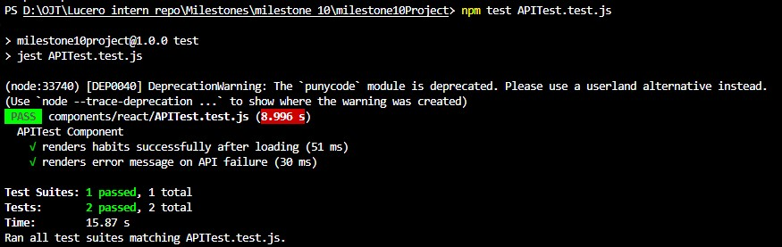
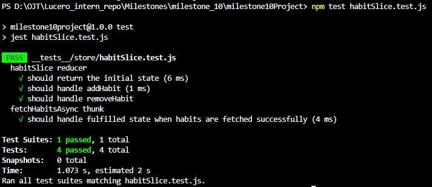

Jianna Monique M. Lucero

# Introduction to Unit Testing with Jest

## Sample Function

```javascript
export const add = (a, b) => {
  return a + b;
};
```

## Test File Containing Multiple Test Cases for Sample Function

```javascript
import { add } from './sum';

describe('add function', () => {
  it('should return the correct sum of two positive numbers', () => {
    const result = add(2, 3);
    expect(result).toBe(5);
  });

  it('should return the correct sum of a positive and a negative number', () => {
    const result = add(5, -2);
    expect(result).toBe(3);
  });

  it('should return the correct sum of two negative numbers', () => {
    const result = add(-4, -6);
    expect(result).toBe(-10);
  });
});
```

## Testing a Simple Utility Function


## Reflection

1. Why is automated testing important in software development?

Automated testing is important in software development because it not only guarantees that the code is correct but also guarantees the system's reliability. Furthermore, it also speeds up the process of software development. By using unit tests to ensure that the code behaves correctly in isolated situations and integration tests to ensure that the system behaves correctly in complex situations, developers are able to detect bugs in the system early in the process when they are easiest to fix. This not only makes it easier to refactor the code and design the system in modules but also makes it easier to document as it can explain how the system should behave. Ultimately, automated testing enables developers to move from repetitive testing to feature building, ensuring that the system not only behaves correctly but also scales well as it continues to grow.

2. What did you find challenging when writing your first Jest test?

While writing my first Jest test, what I found challenging was trying to configure and set up Jest correctly. In addition, this was my first time using Jest, so I had to understand its framework and how to use it when writing my first Jest test. However, after understanding its test structure such as using terms like `describe`, `test`, and `expect`, I was able to get a general flow on how to write my first Jest test. By using Jest to write a test for a simple sum function, I can be able to apply it on writing more complex tasks such as testing React/React Native components or mocking dependencies like conducting API calls.

# Testing React Components with Jest & React Testing Library

## Sample React Component that Displays a message

```javascript
import React from 'react';

export default function MessageDisplay() {
  const handlePress = () => {
    window.alert('Button has been Pressed');
  };

  return (
    <div>
      <h1>Testing React Components with Jest & React Testing Library</h1>
      <button type="button" onClick={handlePress}>
        Press Me
      </button>
    </div>
  );
}
```

## Test File Containing Multiple Test Cases for Sample Function

```javascript
/** @jest-environment jsdom */

import React from 'react';
import { render, screen } from '@testing-library/react';
import userEvent from '@testing-library/user-event';
import MessageDisplay from './MessageDisplay';

describe('MessageDisplay Component', () => {
  let alertSpy;

  beforeEach(() => {
    window.alert = window.alert || (() => {});
    alertSpy = jest.spyOn(window, 'alert').mockImplementation(() => {});
  });

  afterEach(() => {
    alertSpy.mockRestore();
  });

  test('renders the title and button correctly', () => {
    render(<MessageDisplay />);

    const title = screen.getByText(
      /Testing React Components with Jest & React Testing Library/i
    );
    const button = screen.getByRole('button', { name: /Press Me/i });

    expect(title).toBeTruthy();
    expect(button).toBeTruthy();
    expect(button.textContent).toBe('Press Me');
  });

  test('calls alert with correct message when button is clicked', async () => {
    render(<MessageDisplay />);
    const user = userEvent.setup();
    const button = screen.getByRole('button', { name: /Press Me/i });

    await user.click(button);

    expect(alertSpy).toHaveBeenCalledTimes(1);
    expect(alertSpy).toHaveBeenCalledWith('Button has been Pressed');
  });
});
```

## Testing the MessageDisplay Component


## Reflection

1. What are the benefits of using React Testing Library instead of testing implementation details?

- Resilience to Refactoring

If I rearrange my code and rename my variables, a "bad" test will fail since it consists of the test checking my code. By using RTL, the test doesn't care about my code and only cares if the user sees the same thing. This means that my tests will remain as pass even though I'm cleaning up my "messy" code.

- Increased User - Centric Confidence

By mimicking human behavior when interacting with my system, RTL gives me better confidence that my code will work when I put it in front of a real user. This is because RTL check the output that the user actually sees.

- Built-in Accessibility

To find a button in RTL, I often have to search for its "Role" or "Label" (like a screen reader does). This actually makes me write my code to make my app usable for people who are disabled. So if I can't find my button in my test, a person with disabilities can't find my button either.

- Better Readability

By using English words like "getByText" and "getByRole" to write my test, it makes it easier to understand for those who look at my test. This means that anyone can quickly be able to learn what the test is about when looking at it.

- Avoids "Brittle" Tests

When writing tests for my code, I need to ensure that they shouldn't fail for no reason. Using RTL prevents making "brittle" tests since it doesn't involve checking my code. Instead, it checks the output produced from the code.

2. What challenges did you encounter when simulating user interaction?

One of the challenges that I encountered when simulating user interactions was configuring the environment for testing. When I initially tested MessageDisplay.test.js, there was an error that stated that I was using the wrong test environment. I then found out that I had to place this at the top of my MessageDisplay.test.js in order to run the testing process: `/** @jest-environment jsdom */`. This created a virtual browser environment (JSDOM), allowing React Testing Library to render components and simulate user interactions like button clicks.

# Mocking API Calls in Jest

## Sample React component that fetches and displays data from an API

```javascript
import React, { useState, useEffect } from 'react';
import { fetchHabits } from '../../services/api';

export default function APITest() {
  const [habits, setHabits] = useState([]);
  const [loading, setLoading] = useState(true);
  const [error, setError] = useState(null);

  useEffect(() => {
    const loadHabits = async () => {
      try {
        setLoading(true);
        setError(null);
        const data = await fetchHabits();
        setHabits(data);
      } catch (err) {
        setError(err.message || 'Failed to fetch habits');
      } finally {
        setLoading(false);
      }
    };

    loadHabits();
  }, []);

  if (loading) {
    return (
      <div>
        <h2>API Test Component</h2>
        <p>Loading habits...</p>
      </div>
    );
  }

  if (error) {
    return (
      <div>
        <h2>API Test Component</h2>
        <p>Error: {error}</p>
      </div>
    );
  }

  return (
    <div>
      <h2>API Test Component</h2>
      <p>Successfully loaded {habits.length} habits</p>
      <ul>
        {habits.map(habit => (
          <li key={habit.id}>
            <strong>{habit.name}</strong> - {habit.habitName} (
            {habit.habitDuration})
          </li>
        ))}
      </ul>
    </div>
  );
}
```

## Test File Containing Multiple Test Cases for Sample Function

```javascript
/** @jest-environment jsdom */

import React from 'react';
import { render, screen, waitFor } from '@testing-library/react';
import APITest from './APITest';
import { fetchHabits } from '../../services/api';

jest.mock('../../services/api');

describe('APITest Component', () => {
  beforeEach(() => {
    jest.clearAllMocks();
  });

  test('renders habits successfully after loading', async () => {
    const mockData = [
      {
        id: 1,
        name: 'Morning Routine',
        habitName: 'Meditation',
        habitDuration: '30 mins',
      },
    ];

    fetchHabits.mockResolvedValueOnce(mockData);

    render(<APITest />);

    expect(screen.getByText(/Loading habits.../i)).toBeTruthy();

    await waitFor(() => {
      expect(screen.getByText(/Successfully loaded 1 habits/i)).toBeTruthy();
      expect(screen.getByText(/Morning Routine/i)).toBeTruthy();
      expect(screen.getByText(/Meditation/i)).toBeTruthy();
      expect(screen.getByText(/30 mins/i)).toBeTruthy();
    });

    expect(fetchHabits).toHaveBeenCalledTimes(1);
  });

  test('renders error message on API failure', async () => {
    fetchHabits.mockRejectedValueOnce(new Error('Network Error'));

    render(<APITest />);

    await waitFor(() => {
      expect(screen.getByText(/Error: Network Error/i)).toBeTruthy();
    });
  });
});
```

## Testing the API Component



## Reflection

1. Why is it important to mock API calls in tests?

Mocking API calls is important in tests because it ensures that there is a controlled environment where there are no "flaky" tests caused by server downtime. Furthermore, this can greatly speed up the development process, as there are no financial constraints, nor are there constraints on the number of requests. Lastly, they provide robust error handling since "edge cases" like 500-level server errors can be easily simulated. This means that it ensures that the test is failing because of my code, and not because of some external service.

2. What are some common pitfalls when testing asynchronous code?

- Forgetting to `return` or `await`

If I don’t tell the test to wait for the asynchronous process to complete, the test will simply go to the end of the function and report a "Pass" without actually waiting for the code to execute. This creates a false positive, wherein the test looks successful but didn't actually check anything

- Swallowing Errors and Unhandled Rejections

If I don’t wrap a `try/catch` block around my async code or a `.catch()` block, I can lose errors or make the test simply crash without telling me. This makes the debugging process difficult since the test won't inform me why or where the code failed.

- Race Conditions and Flaky Tests

If I use fixed timers to wait for the change to happen, I need to be very careful since computers can process things at different speeds. If my computer is very slow, the timer will go off before the code finishes running, causing the test to fail at random.

- Improper Mocking of Async Dependencies

When I'm creating a mock API for my code to interact with, I need to make sure that I'm telling the code to expect a successful (resolved Promise) or failing (rejected Promise) situation. If I haven’t set up the mock to return a Promise, my code will break because it expects to `await` something that isn’t there.

- Ignoring Lifecycle and Cleanup Issues

When I'm doing tests, I need to make sure that I'm not doing an asynchronous task that finishes after I've already unmounted the UI. If I don’t clean up background tasks properly, I can end up with memory leaks or "act" errors where one test can interfere with another.

# Testing Redux with Jest

## Sample Redux Slice

```javascript
import { createSlice, createAsyncThunk } from '@reduxjs/toolkit';
import { fetchHabits } from '../../../services/api';

export const fetchHabitsAsync = createAsyncThunk(
  'habits/fetchHabitsAsync',
  async (_, { rejectWithValue }) => {
    try {
      const data = await fetchHabits();
      return data;
    } catch (error) {
      return rejectWithValue(error.message || 'Failed to fetch habits');
    }
  }
);

const initialState = {
  habits: [],
  loading: false,
  error: null,
};

export const habitSlice = createSlice({
  name: 'habits',
  initialState,
  reducers: {
    addHabit: (state, action) => {
      state.habits.push(action.payload);
    },
    removeHabit: (state, action) => {
      state.habits = state.habits.filter(habit => habit.id !== action.payload);
    },
  },
  extraReducers: builder => {
    builder.addCase(fetchHabitsAsync.fulfilled, (state, action) => {
      state.loading = false;
      state.habits = action.payload;
    });
  },
});

export const { addHabit, removeHabit } = habitSlice.actions;

export default habitSlice.reducer;
```

## Test File Containing Multiple Test Cases for Redux slice

```javascript
import habitReducer, {
  addHabit,
  removeHabit,
  fetchHabitsAsync,
} from '../../app/store/slices/habitSlice';
import { configureStore } from '@reduxjs/toolkit';
import { fetchHabits } from '../../services/api';

jest.mock('../../services/api');

describe('habitSlice reducer', () => {
  const initialState = {
    habits: [],
    loading: false,
    error: null,
  };

  test('should return the initial state', () => {
    expect(habitReducer(undefined, { type: 'unknown' })).toEqual(initialState);
  });

  test('should handle addHabit', () => {
    const newHabit = {
      id: 1,
      name: 'Jia',
      habitName: 'Meditation',
      habitDuration: '30 mins',
    };

    const action = addHabit(newHabit);
    const newState = habitReducer(initialState, action);

    expect(newState.habits).toHaveLength(1);
    expect(newState.habits[0]).toEqual(newHabit);
  });

  test('should handle removeHabit', () => {
    const currentState = {
      habits: [
        {
          id: 1,
          name: 'Monique',
          habitName: 'Meditation',
          habitDuration: '30 mins',
        },
      ],
      loading: false,
      error: null,
    };

    const action = removeHabit(1);
    const newState = habitReducer(currentState, action);

    expect(newState.habits).toHaveLength(0);
  });
});

describe('fetchHabitsAsync thunk', () => {
  let store;

  beforeEach(() => {
    store = configureStore({
      reducer: {
        habits: habitReducer,
      },
    });
  });

  afterEach(() => {
    jest.clearAllMocks();
  });

  test('should handle fulfilled state when habits are fetched successfully', async () => {
    const mockHabits = [
      {
        id: 1,
        name: 'User 1',
        habitName: 'Meditation',
        habitDuration: '30 minutes',
      },
      {
        id: 2,
        name: 'User 2',
        habitName: 'Exercise',
        habitDuration: '45 minutes',
      },
    ];

    fetchHabits.mockResolvedValue(mockHabits);

    await store.dispatch(fetchHabitsAsync());

    const state = store.getState().habits;
    expect(state.loading).toBe(false);
    expect(state.habits).toEqual(mockHabits);
    expect(state.habits).toHaveLength(2);
    expect(state.error).toBe(null);
  });
});
```

## Testing the Redux Slice



## Reflection

1. What was the most challenging part of testing Redux?

The most challenging part of testing Redux was for writing a test for an asynchronous Redux action. It was my first time implementing an asynchronous Redux action, and implementing "side effects" that don't happen instantly. Compared to testing actions that happen instantly, I had to learn to make async code that required me to wait for it to finish executing. It took me quite a while to figure out that testing an asynchronous Redux action required me to create a separate test section for conducting the tests for asynchronous actions.

2. How do Redux tests differ from React component tests?

The key differences between Redux tests and React component tests are based on what is being tested and the environment of testing. Redux testing is based on testing the logic and state management of an application as a pure JavaScript function, whereas React component testing is based on testing the user interface and user experience of an application. Redux reducers and actions are not related to the user interface of an application and can be tested without rendering them in a browser, making it possible to use any testing framework and ensuring that specific inputs produce specific outputs. On the other hand, React component testing is based on rendering the user interface of an application and ensuring it works as expected under different user interactions, making it necessary to use a testing framework like React Testing Library. In summary, Redux testing is for ensuring the logic of an application is working correctly, whereas React component testing is for ensuring the user experience of an application is working correctly.
