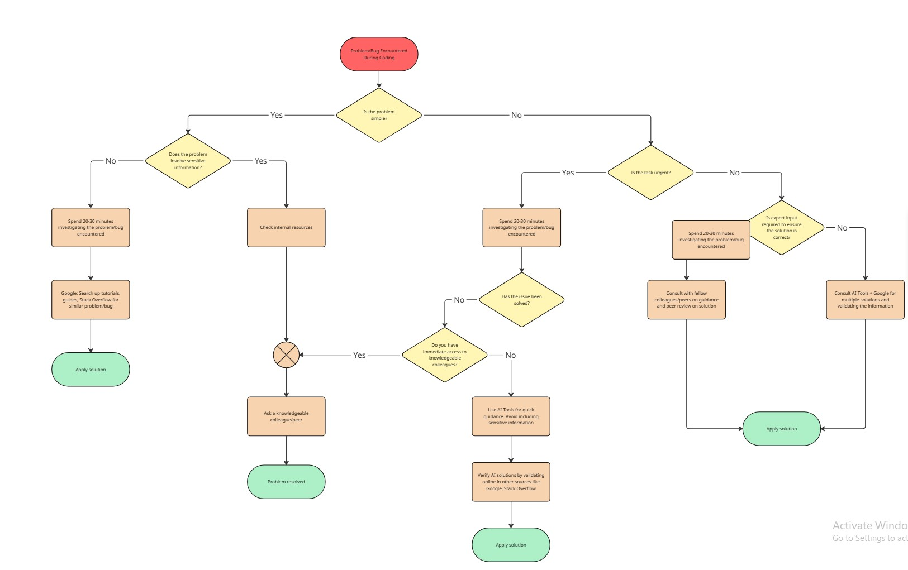

Jianna Monique M. Lucero

# When you get stuck - what next?

## Decision Making Framework in Flowchart Format

[Download or view the PDF file](../milestone_11//Lucero_Decision_Framework.pdf)

## Screenshot of Decision Making Framework

## Reflection

1. When do you prefer using AI vs. searching Google?

### When to Use AI

- For learning unfamiliar concepts/frameworks

- For exploring multiple solutions when it comes to troubleshooting a complex, non - urgent issue/solution that doesn't involve sensitive information

- For quick quidance on complex, urgent and unsolved problems when colleagues are unavailable

### When to search Google

- For investigating/troubleshooting simple problems that do not involve sensitive information

- For verifying and validating solutions provided by AI tools

- For finding and validating solution for complex, non - urgent tasks. Can work hand in hand with AI.

2. How do you decide when to ask a colleague instead?

### When to Ask A Colleague

- For simple issues that involve sensitive information. This is done after checking internal resources/documentation

- For urgent complex problems. This is conducted after doing 20-30 minutes of investigation and the problem remaining unsolved.

- For non - urgent complex problems. If I need expert input to ensure that my proposed solution is correct.

3. What challenges do developers face when troubleshooting alone?

- Lack of Peer Perspective and Blind Spots

Troubleshooting alone means that developers would be missing out on second opinions, which would otherwise help to avoid blind spots and other alternative solutions. There would be no one to offer code review to help detect any mistakes or best practices before the code enters production.

- Emotional and Mental Fatigue

When a developer troubleshoots alone, they have to deal with all the issues in fixing bugs or updating code, which would otherwise lead to extreme levels of stress and burnout. And since they have nobody to turn to in case of any issues or problems with the code, it leads to them getting stuck in an unproductive frame of mind for long periods of time.

- Technical and Knowledge Limitation

When a developer troubleshoots alone, they would have to deal with all aspects of the code, including both front-end and back-end programming. As a result, he or she would have shallow knowledge in all areas rather than in-depth knowledge in a specialized area. As a result, troubleshooting any unfamiliar code would be extremely slow and tedious due to the lack of specialization in a specific area. Furthermore, solo developers would have limited debugging skills in dealing with complex code architectures that would otherwise have bugs that are hard to trace.
