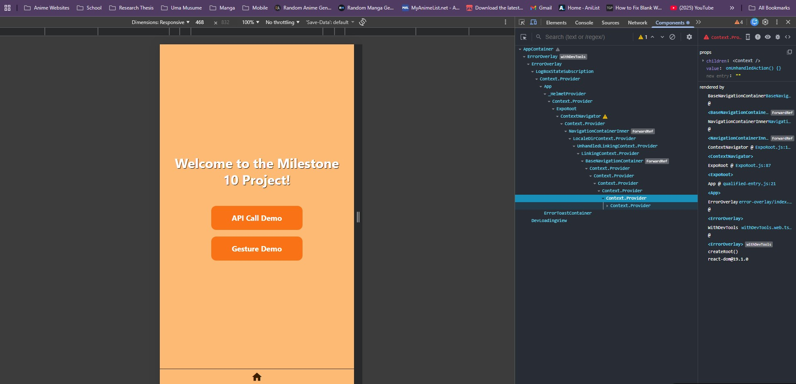

Jianna Monique M. Lucero

# Debugging React Native Apps (Flipper, Metro, and Console Logs)\

## Using React DevTools for milestone10Project



The image above shows React DevTools being used to inspect milestone10Project to inspect the different components and props present in my app. By using React DevTools, I am able to identify the structure and relationship of the different components present in my app. Furthermore, I can be able to record the app's performance, making it easier to identify any bottlenecks or unnecessary re-renders.

## Sample Code Snippet for Logging Network Requests for milestone10Project Using axios interceptors

```javascript
axios.interceptors.request.use(
  config => {
    console.log('REQUEST:', {
      method: config.method?.toUpperCase(),
      url: config.url,
      data: config.data,
    });
    return config;
  },
  error => {
    console.error('REQUEST ERROR:', error);
    return Promise.reject(error);
  }
);

axios.interceptors.response.use(
  response => {
    console.log('RESPONSE:', {
      status: response.status,
      url: response.config.url,
      data: response.data,
    });
    return response;
  },
  error => {
    console.error('RESPONSE ERROR:', {
      status: error.response?.status,
      url: error.config?.url,
      message: error.message,
    });
    return Promise.reject(error);
  }
);
```

## Reflection

1. How does Metro help in debugging a React Native app?

Metro assists me in debugging a React Native app by offering tools and features that quicken the development process. A good example of the tools that Metro offers is Fast Refresh, which involves injecting new updates to the code without reloading the state of the application. In addition, Metro offers an error reporting feature that displays clear warnings and error messages on the screen of the device as well as on my terminal. Finally, Metro acts as the central hub for viewing console logs or the in-app Developer Menu, giving me quick control over performance monitoring and advanced debugging settings.

2. What debugging features does Flipper provide?

- Network Inspector

This allows me to monitor all outgoing network traffic, such as HTTP and HTTPS requests, and WebSocket messages, just like Chrome DevTools. It also allows me to view and replay requests, analyze response times, and troubleshoot connectivity problems.

- Layout Inspector

This feature offers a real-time view of the hierarchy of the UI components, supporting both native Android and iOS views, and React Native components. I can also view and modify component props, state, and styles, such as padding and margin, in real-time.

- Logs Viewer

This feature combines all the different types of logs, such as console.log, Logcat, and iOS device logs, into a single view. It makes debugging easier because I can easily filter all the combined logs.

- Crash Reporter

If a failure occurs in the app, this feature offers immediate notifications with detailed stack traces, and it surfaces metadata related to the crash, helping me easily identify the cause of the failure.

- Database and Storage Viewer

This tool allows me to view and modify local SQLite databases, as well as data in Shared Preferences or AsyncStorage. It is a critical feature because it is important to test that data is handled properly in the app.

- Performance Monitoring

This allows me to monitor the health of the app, including CPU, memory, and frame rate, helping me identify resource-intensive processes that may cause the app to lag or fail.

3. How can you inspect network requests in React Native?

In order to inspect the network requests in React Native, I can use tools like React Native DevTools, which include a special ‘Network’ tab that can capture ‘fetch()’ and ‘XMLHttpRequest’ requests automatically when launched using the Metro terminal (by pressing ‘j’) or the in-app developer menu. I can also use third-party applications such as Flipper, which includes a special ‘Network’ plugin that can provide the requests directly. Although Metro logs provide the quickest feedback using basic ‘console.log()’ statements for the request parameters and responses, I can use these tools alongside advanced inspection tools of Flipper and React Dev Tools to inspect the requests.

Below is an example of an asynchronous network request where tools like React Native DevTools or Flipper are used to display these types of calls:

```javascript
const fetchUserData = async (userId: string) => {
  try {
    const response = await fetch(`https://api.example.com/users/${userId}`, {
      method: 'GET',
      headers: {
        'Authorization': 'Bearer token123',
        'Content-Type': 'application/json',
      },
    });

    const data = await response.json();
    return data;
  } catch (error) {
    console.error('Error fetching user:', error);
    throw error;
  }
};
```
