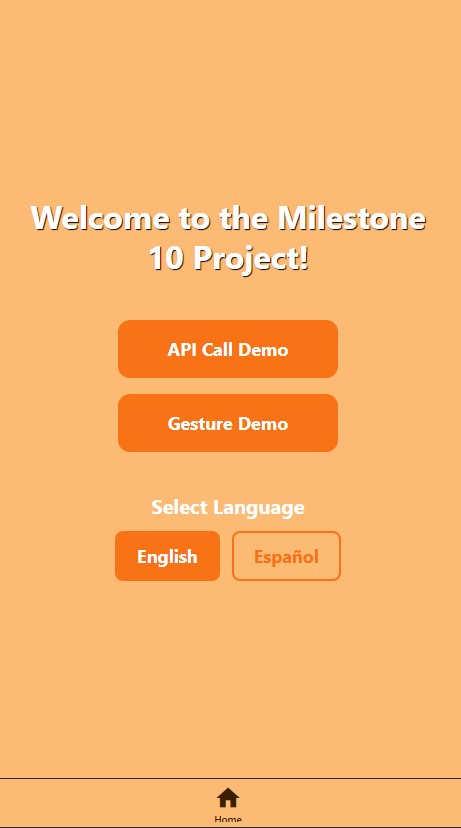
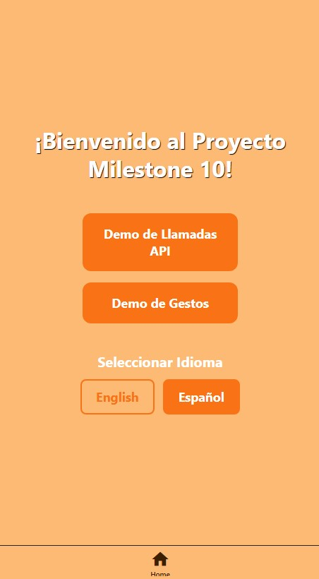

Jianna Monique M. Lucero

# Implementing Localisation (i18n) with react-i18next

## Sample Implementation of Language Switching in milestone10Project

I implemented language switching in the home screen of the milestone10Project.

Below are the translation.json files for both English and Spanish languages:

### English

```json
{
  "welcome": "Welcome to the Milestone 10 Project!",
  "apiCallDemo": "API Call Demo",
  "gestureDemo": "Gesture Demo",
  "language": "Language",
  "selectLanguage": "Select Language",
  "english": "English",
  "spanish": "Español"
}
```

### Spanish

```json
{
  "welcome": "¡Bienvenido al Proyecto Milestone 10!",
  "apiCallDemo": "Demo de Llamadas API",
  "gestureDemo": "Demo de Gestos",
  "language": "Idioma",
  "selectLanguage": "Seleccionar Idioma",
  "english": "English",
  "spanish": "Español"
}
```

Here's the i18n service configuration for milestone10Project using i18next::

```javascript
import i18n from 'i18next';
import { initReactI18next } from 'react-i18next';
import * as Localization from 'expo-localization';

import en from '../locales/en/translation.json';
import es from '../locales/es/translation.json';

const resources = {
  en: { translation: en },
  es: { translation: es },
};

const getDeviceLanguage = () => {
  return Localization.getLocales()[0]?.languageCode || 'en';
};

// Initialize i18n synchronously with device language
i18n.use(initReactI18next).init({
  resources,
  lng: getDeviceLanguage(),
  fallbackLng: 'en',
  interpolation: { escapeValue: false },
});

export default i18n;
```

## Implementation of Language Switching in Home Screen of milestone10Project

```javascript
import { useRouter } from 'expo-router';
import { StyleSheet, View } from 'react-native';
import { Button, useTheme } from '@rneui/themed';
import { useTranslation } from 'react-i18next';

import { ThemedText } from '@/components/themed-text';
import { ThemedView } from '@/components/themed-view';

export default function HomeScreen() {
  const router = useRouter();
  const { theme } = useTheme();
  const { t, i18n } = useTranslation();

  const handleApiDemo = () => {
    router.push('./api-demo');
  };

  const handleGestureDemo = () => {
    router.push('./gesture-demo');
  };

  const changeLanguage = (lng: string) => {
    i18n.changeLanguage(lng);
  };

  return (
    <ThemedView style={styles.container}>
      <ThemedText type="title" style={styles.titleText}>
        {t('welcome')}
      </ThemedText>

      <Button
        title={t('apiCallDemo')}
        type="solid"
        onPress={handleApiDemo}
        buttonStyle={[
          styles.buttonStyle,
          {
            backgroundColor: theme.colors.primary,
            borderColor: theme.colors.primary,
            marginBottom: 16,
          },
        ]}
        titleStyle={[
          styles.buttonTitle,
          {
            color: 'white',
          },
        ]}
      />

      <Button
        title={t('gestureDemo')}
        type="solid"
        onPress={handleGestureDemo}
        buttonStyle={[
          styles.buttonStyle,
          {
            backgroundColor: theme.colors.primary,
            borderColor: theme.colors.primary,
            marginBottom: 40,
          },
        ]}
        titleStyle={[
          styles.buttonTitle,
          {
            color: 'white',
          },
        ]}
      />

      <ThemedText type="subtitle" style={styles.languageLabel}>
        {t('selectLanguage')}
      </ThemedText>

      <View style={styles.languageButtonContainer}>
        <Button
          title={t('english')}
          type={i18n.language === 'en' ? 'solid' : 'outline'}
          onPress={() => changeLanguage('en')}
          buttonStyle={[
            styles.languageButton,
            {
              backgroundColor:
                i18n.language === 'en' ? theme.colors.primary : 'transparent',
              borderColor: theme.colors.primary,
            },
          ]}
          titleStyle={{
            color: i18n.language === 'en' ? 'white' : theme.colors.primary,
            fontWeight: 'bold',
          }}
        />

        <Button
          title={t('spanish')}
          type={i18n.language === 'es' ? 'solid' : 'outline'}
          onPress={() => changeLanguage('es')}
          buttonStyle={[
            styles.languageButton,
            {
              backgroundColor:
                i18n.language === 'es' ? theme.colors.primary : 'transparent',
              borderColor: theme.colors.primary,
              marginLeft: 12,
            },
          ]}
          titleStyle={{
            color: i18n.language === 'es' ? 'white' : theme.colors.primary,
            fontWeight: 'bold',
          }}
        />
      </View>
    </ThemedView>
  );
}

const styles = StyleSheet.create({
  container: {
    flex: 1,
    alignItems: 'center',
    justifyContent: 'center',
    paddingHorizontal: 20,
  },
  titleText: {
    color: '#FFFFFF',
    textAlign: 'center',
    lineHeight: 40,
    paddingVertical: 4,
    textShadowColor: '#000000',
    textShadowOffset: { width: 1, height: 1 },
    textShadowRadius: 1,
    marginBottom: 40,
  },
  buttonStyle: {
    borderWidth: 2,
    paddingVertical: 14,
    borderRadius: 12,
    width: 220,
  },
  buttonTitle: {
    fontWeight: 'bold',
    fontSize: 18,
  },
  languageLabel: {
    color: '#FFFFFF',
    textAlign: 'center',
    marginBottom: 12,
  },
  languageButtonContainer: {
    flexDirection: 'row',
    justifyContent: 'center',
    alignItems: 'center',
  },
  languageButton: {
    borderWidth: 2,
    paddingVertical: 10,
    paddingHorizontal: 20,
    borderRadius: 8,
  },
});
```

## Output of Language Switching on milestone10Project





## Reflection

1. How does `react-i18next` handle translations?

'react-i18next' handles translations by utilizing a main engine that helps connect the code of my app with lists of words that are available in various languages. I first set up a simple guide that helps the app know the various languages that are available and where the translation files, which are lists of words and their corresponding translations, are located. The app will then automatically know the language the user wants to use when they open the app, and it will retrieve the appropriate words from the server. Furthermore, by using `react-i18next`, the app can look up the words and display the appropriate word on the screen. The library can also help the app with instantly changing the language when the user wants to do so, keeping everything smooth and easy to understand.

2. What challenges arise when localising a React Native app?

- UI and Layout Inconsistencies

Translated text may occupy more space compared to the original English text, which could lead to UI components overlapping one another. Furthermore, handling Right-to-Left language support involves intricate mirror image handling of the UI components, which is quite complex in nature.

- Performance and Technical Hurdles

Including all the translation files in the JavaScript bundle increases the overall size of the app and hence slows down the initial loading of the app. Programmers might even face memory management problems during the execution of the translation process.

- Translation and Process Management

Syncing the translation files manually across different platforms often leads to problems. The translated content might end up missing certain aspects of the original content, or could even turn out to be offensive to the users.

3. How would you test localisation support in an app?

I would begin testing the support for localisation in my app first by performing a 'practice run' with mock translations to ensure the layout is okay and that there aren't any words left in the original language. Then, I would make a deep check to ensure the new words make sense, fit perfectly on the screen without any overlapping, and that things like dates, money, and phone numbers comply with local rules. Another thing to test is special cases, such as ensuring the whole app 'flips' when the language is from right to left and that the language instantly changes when a user clicks a button. Finally, having people who know the language test the app will ensure that everything is perfect and natural for everyone, regardless of their location.
