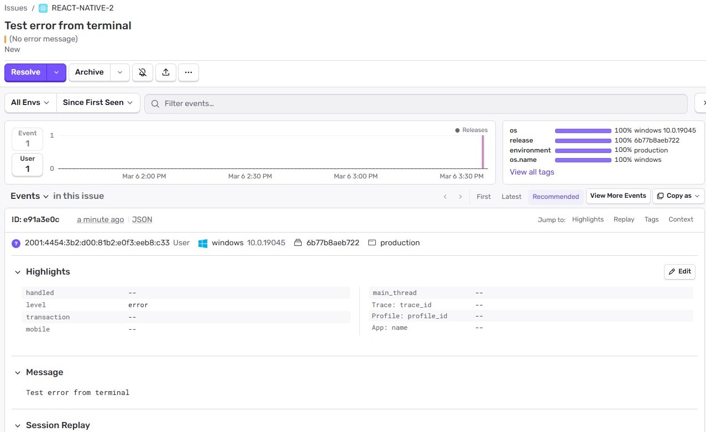

Jianna Monique M. Lucero

# Logging and Crash Reporting with Sentry

## Setting Up Error Reporting in milestone10Project

Signed up at Sentry.io and configured the milestone10Project using the following command: `npx @sentry/wizard@latest -i reactNative --saas --org jianna-monique-m-lucero --project react-native`

```javascript
import {
  DarkTheme,
  DefaultTheme,
  ThemeProvider as NavigationThemeProvider,
} from '@react-navigation/native';
import { ThemeProvider } from '@rneui/themed';
import { Stack } from 'expo-router';
import { StatusBar } from 'expo-status-bar';
import { StyleSheet } from 'react-native';
import { GestureHandlerRootView } from 'react-native-gesture-handler';
import { Provider } from 'react-redux';
import 'react-native-reanimated';

import { useColorScheme } from '@/hooks/use-color-scheme';
import { rneuiTheme } from '@/constants/theme-config';
import { store } from '../store/store';
import * as Sentry from '@sentry/react-native';

Sentry.init({
  dsn: 'https://1934ce8c008e67dd77e535c9f33f8935@o4510996302004225.ingest.us.sentry.io/4510996303446016',

  // Adds more context data to events (IP address, cookies, user, etc.)
  // For more information, visit: https://docs.sentry.io/platforms/react-native/data-management/data-collected/
  sendDefaultPii: true,

  // Enable Logs
  enableLogs: true,

  // Configure Session Replay
  replaysSessionSampleRate: 0.1,
  replaysOnErrorSampleRate: 1,
  integrations: [
    Sentry.mobileReplayIntegration(),
    Sentry.feedbackIntegration(),
  ],

  // uncomment the line below to enable Spotlight (https://spotlightjs.com)
  // spotlight: __DEV__,
});

export const unstable_settings = {
  anchor: '(tabs)',
};

export default Sentry.wrap(function RootLayout() {
  const colorScheme = useColorScheme();

  return (
    <Provider store={store}>
      <GestureHandlerRootView style={styles.root}>
        <ThemeProvider theme={rneuiTheme}>
          <NavigationThemeProvider
            value={colorScheme === 'dark' ? DarkTheme : DefaultTheme}
          >
            <Stack>
              <Stack.Screen name="(tabs)" options={{ headerShown: false }} />
              <Stack.Screen name="api-demo" options={{ headerShown: false }} />
              <Stack.Screen
                name="gesture-demo"
                options={{ headerShown: false }}
              />
            </Stack>
            <StatusBar style="auto" />
          </NavigationThemeProvider>
        </ThemeProvider>
      </GestureHandlerRootView>
    </Provider>
  );
});

const styles = StyleSheet.create({
  root: {
    flex: 1,
  },
});
```

## Simulate an error and verify that it appears in Sentry logs

Sent the following line in the terminal to simulate an error `npx @sentry/cli send-event -m "Test error from terminal"`

## Screenshot of error appearing in Sentry Logs



## Reflection

1. Why is logging important in a production React Native app?

Logging is important in a production React Native app, since this allows me to avoid flying blind when my app leaves the safety of my personal device and enters thousands of unique user devices. Although console.log statements are helpful in a development scenario, a solid logging plan enables me to get the information I need to identify the exact cause of a crash, even after it has occurred. With the ability to track performance metrics, I can identify problems before they compromise user experience. Overall, these logs assist me in debugging problems quickly and understanding how users interact with my application, all while keeping everything running smoothly and safely.

2. How does Sentry improve debugging and issue tracking?

Sentry aids in better debugging and issue tracking, as raw, unhandled errors are turned into useful information, helping the developer understand the issue better, hence fixing the problem in real-time. Unlike making assumptions, the developer can actually comprehend the problem through detailed reports, including stack traces, user actions, and Session Replay, which show the exact sequence of events that led to the bug. Furthermore, Sentry helps in the efficient workflow of fixing bugs, as the platform groups similar bugs, prioritizes the bugs based on the number of users affected, and even helps identify the exact code commit that caused the bug. As a result, Sentry helps the teams move from the reactive approach to the proactive approach, saving more time fixing the bugs than actually investigating them.

3. What are best practices for handling and logging errors?

- Catch All Exceptions Globally

Utilizing global error handlers will ensure that the application will not crash due to an unhandled system error. This will ensure that the application remains active or crashes gracefully rather than completely shutting down for the user.

- Prevent Information Leakage

Always display generic and user-friendly error messages, and never display any information that is technically detailed, such as stack trace information. This is especially important when the user is logging in, as hackers will attempt to gather system information through this means.

- Implement Retry Mechanisms

For temporary errors, such as network timeout errors, my code should automatically attempt the operation again. This will ensure the stability of the program, as small problems will be resolved without any user intervention.

- Fail Safely and Proactively

The application will ensure that any incomplete transactions will be rolled back to ensure a secure state when an error occurs. Furthermore, the user inputs will always be validated to ensure that any potential security issues will not occur before they reach my main code.

- Use Structured Logging

The logs should be stored in a format that is easily readable by machines, such as JSON, rather than a simple text format. This will ensure that the logs will be easy to search through quickly.

- Maintain Consistent Log Levels

Each log message must have standard levels such as DEBUG, INFO, WARN, etc. This helps the me and the rest of my team understand which issues need immediate attention and which ones are for information only.

- Include Rich Context

Each log message must have unique IDs such as User IDs or Session IDs, which can help me trace one error through various parts of the system. Such information is crucial for understanding the "who" and "where" of the bug.

- Centralize and Protect Data

All the logs must be stored in one location that is easily accessible for real-time analysis. Most importantly, I must ensure that my logs are always "scrubbed" so that information such as passwords or other personal details are never stored.

- Set Up Real-Time Alerts

My system must have the option to send immediate notifications to my team for high-severity errors. This ensures that I can address the errors immediately before they affect a larger number of users.

- Review Logs Regularly

My logs must be scanned periodically to look for patterns or possible errors. Using my logs to recreate errors is the best way to debug without affecting users.
