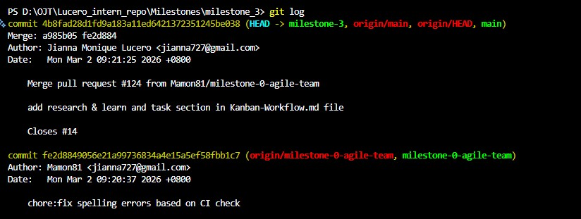

Jianna Monique M. Lucero

# Git concept: staging vs committing

1. What is the difference between staging and committing?

Staging moves the changes to the index/staging area, marking them for being included into the next commit, while committing saves the changes that are in the staging area permanently to the Git repository. Staging also allows me to be able to pick changes to include, supporting granular control and smaller, focused commits while committing creates a permanent snapshot of the project's current state. In summary, staging is important when separating unrelated changes, while committing is the final step to adding those changes into the project's history.

2. Why does Git separate these two steps?

Git separates staging and committing in order to give developers granular control over their project's history. This allows them to be able to select and group together related changes into clean commits rather than combining all changes into one, messy update. By using the staging area, I can be able to review my "draft changes", and fix small typos to my code before it becomes a permanent part of my repository. This can ensure that each commit represents a single, clean and complete change, making it easier for the rest of my team to understand and revert the change if necessary.

3. When would you want to stage changes without committing?

Staging changes without committing is useful for being able to prepare clean and focused commits, to better manage work in progress and effectively separate unrelated changes or modifications. Staging serves as a temporary holding space, allowing me to be able to hand-pick specific files or changes that belong to a single, finished task.

By grouping similar changes/files into clean commits, I can also be able to keep temporary files/changes out of the shared repository before committing. In conclusion, staging changes before committing can transform my messy working directory into a more organized one, making it easier for the rest of my team to be able to track the progress of the project, understand how it's slowly evolving, and be able to undo any specific changes in case something goes wrong.

# Branching & Team Collaboration

1. Why is pushing directly to main problematic?

Pushing directly to main is problematic because it can compromise the stability of the project's most critical and production-ready environment. By using the main branch as a place for modifying your project can result in an increased risk to introducing unfinished or broken code into a live application. Furthermore, this method also bypasses proper review of the modified code by your other team mates as well as skipping the testing phases, resulting in errors popping up during the final product. Furthermore, pushing directly to main also compromises team collaboration, since there is an increased chance where developers may accidentally overwrite each other's work or encounter complex problems that are difficult to resolve on a shared branch. In conclusion, pushing directly to main makes it not only difficult for the project's history to track but also limits the team's ability to be able to safely undo specific mistakes without disrupting the entire live working project.

2. How do branches help with reviewing code?

Branches help with reviewing the code as it can provide a dedicated and isolated area wherein changes for a specific task can be closely inspected while the stable part of the project in the main branch is not affected. Since a specific branch is mainly focused on a single feature or fix, this gives reviewers and testers the opportunity to provide a more detailed feedback on a code that is easily manageable compared to being overwhelmed by unnecessary or unrelated changes. In summary, by making branches, this ensures that only high-quality and tested changes are merged in to main codebase, making the entire development process of a project more organized and reliable.

3. What happens if two people edit the same file on different branches?

If two people edit the same file on different branches, Git often handles it automatically depending on the changes being applied to the same file. If the edits are in separate lines of the file, Git will simply merge both sets of edits into a single version with no issues present. However, if both individuals modify the exact same line, Git will stop the merge, causing a merge conflict. If this happens, the person who is responsible for merging should manually review the code, decide which changes to keep, and remove the conflict markers before the final version is committed to the repository.

# Advanced Git Commands & When to Use Them

1. What does each command do?

git checkout main -- restores a clean version of a specific file from the main branch by pulling it from the main branch. It's not only used to overwrite local errors but also serves as an "undo" button for specific files by restoring them back to the project's stable and working form.

git cherry-pick - allows me to grab a single, specific commit from one branch and apply it to another branch without merging everything else. This results in the creation of a new, distinct commit on my current branch that replicates the exact changes from the commit from the branch I selected.

git log - lists down every change made to the repository in reverse order. The details provided in the log include who made the change, what the change was and when the change occurred during the branch's lifecycle. It also provides essential context for a team to see how their project has evolved over days, months, or years.

git blame - inspects a code line by line in order to identify the last person to modify every single line of a file. It provides a clear map of who modified each line for the entire codebase. It displays the commit hash and timestamps for every line to better pinpoint exactly when a specific change was introduced.

2. When would you use it in a real project (hint: these are all really important in long running projects with multiple developers)?

git checkout main -- `<file>`is used when I've accidentally modified, removed or in some cases corrupted a file and I need to instantly revert it back to its original state from the main branch. This is especially helpful when I'm trying to fix an error or bug, but the error or bug got even worse than before, and I need to quickly restore the code back to its functional version.

Screenshot of Me Using git checkout main -- `<file>`:

I accidentally modified a section in the file, and by using git checkout main -- `<file>`, I was able to quickly revert the file back to its original state without risking an error or bug to occur.

git cherry-pick `<commit>` - is used when a teammate has written a fix to a critical bug on a different branch that I need immediately, but I'm not ready to pull in the rest of their unfinished work on their respective branch. This command is essential to me as it can allow me to continue being productive on my own branch by adapting important updates or changes from other branches without waiting for them to be finalized.

Screenshot of Me using git cherry-pick `<commit>`:

git log - in cases where a feature starts malfunctioning, the command is used during debugging in order to trace the exact timeline of when the feature starts malfunctioning. It is also used to review the contributions of my team members during the development cycle of the project.

Screenshot of Me using git log:

I used git log to track down my recent commits to see my current progress on my onboarding repository.

git blame `<file>` - is used when I encountered a confusing piece of code and need to identify who the original author is of said code to ask for clarifications or to provide feedback during a review. This command makes it easier to deliver a private feedback session to the right person if ever a bug is discovered.

Screenshot of Me using git blamne `<file>`:

I used git blame `<file>` to track down the changes in my git_understanding.md file. Since it's only me modifying the files, the original author of the changes in the file are from mine alone. However, in future projects, I can be able to see other collaborators and their respective changes in a file by using git blame `<file>`.

3. What surprised you while testing these commands?

What surprised me when using these commands is how easy it is to apply specific changes from one branch to the current branch I'm working on. It improves my productivity now that I don't need to wait until the branch I want to merge onto my current branch is complete. In addition, I am surprised by the type of commands that allow me to view the complete and detailed history of my previous commits as it can help be more aware on specific commits in cases when a feature or bug goes wrong. I was impressed that it not only allowed me to view who made the change, but also what the change was and when that change was made.

# Understand git bisect

1. What does git bisect do?

Git bisect is a command used during debugging that utilizes a binary search algorithm to quickly and efficiently find the exact commit in a project's history that introduced a bug in the project. By marking down a commit as "good" where the code was still functional and marking down a commit as "bad" where the bug exists, Git will automatically check out the midpoint between these two commits in order for the developer to test the commits between these two commits. Furthermore, this command disregards branch structures or the commit message. Instead, it focuses on the functional state of the code in order to pinpoint the exact change that caused the bug or issue to occur

2. When would you use it in a real-world debugging situation?

Git bisect can be used in a real-world debugging situation when it comes to dealing with subtle bugs or a visible decreases in performance. It is also particularly useful in cases wherein a user reports an issue in a specific release version that isn't present in current development. During this case, it is highly possible that it will involve you searching thoroughly through hundreds or thousands of commits to find the breaking point. This kind of case means that git bisect is a highly recommended command to use especially since it involves combing through hundreds or thousands of commits in order to find where the bug originated.

3. How does it compare to manually reviewing commits?

Compared to manually reviewing commits, git bisect is significantly faster and more reliable due to its binary search algorithm. During git bisect, it involves cutting the searching of commits into half in each step which is quicker compared to checking commits one by one. Furthermore, manually reviewing commits is not only time consuming but can also lead to misunderstandings due to vague commit messages or overlooked subtle errors. On the other hand, git bisect can be fully automated using scripts in order to determine the culprit without human intervention.

# Writing Meaningful Commit Messages

1. What makes a good commit message?

A good commit message is that it is able to clearly communicate "what" exactly is the change being contained in the commit as well as "why" is the change being applied. This ensures that future readers as well as other team members are able to understand your original intent of the commit without needing to guess it. Furthermore, a good commit message should represent the commit's single, focused change instead of a mixture of unrelated updates. In conclusion, a good commit message should be descriptive instead of vague in order to ensure that the repository's history and its pushed commits are easy to navigate and review, even if new commits and changes to the code are being applied.

2. How does a clear commit message help in team collaboration?

A clear commit message can help in team collaboration by serving as a reliable way to effectively communicate between the members of a team. By using a clear commit message, it can allow other members in the team to be able to understand the context and reasoning behind a change in the codebase. This also reduces the need to interrupt the author for clarification on the commit message since the commit message is able to clearly convey the purpose of the change to the code base.

By making the commit message clear on what and why the change is, these messages are able to provide essential documentation that makes reviewing the code more proficient and less prone to misunderstanding. Furthermore, it makes it easier for a team to be able to navigate the repository's history, track the progress of a specific feature, and be able to easily pinpoint the origin of bugs during debugging and troubleshooting. In conclusion, clear commit messages can create a professional environment where the entire team can effectively communicate with one another thanks to maintaining a traceable codebase throughout the entire term of a project.

3. How can poor commit messages cause issues later?

Poor commit messages can cause issues later on as it can cause a project's history to be unclear or confusing. Having a confusing repository's history can force future developers to spend a lot of time trying to understand the intent behind old changes. Furthermore, when commit messages are vague, it makes it nearly impossible to use the repository's history to track down the source of a new bug or to safely undo a mistake without affecting the other parts of the code. This lack of clarity forces other members of the team to spend a lot of time manually tracing code paths to understand a past decision or change, increasing the risk of introducing new bugs while trying to fix old ones. Lastly, when working in a professional and collaborative environment, poor documentation can lead to an increased risk of accidentally overwriting someone else's code and re-introducing old errors back into the system during updates. In conclusion, having poor commit messages can compromise the traceability and long-term maintainability of the entire codebase if continued to be applied throughout the entire project's lifecycle.

# Pull Requests

1. Why are PRs important in a team workflow?

Pull Requests are important in a team workflow as they serve as a checkpoint that ensures that the code being integrated into main branch is proprely tested, assessed and reviewed. By providing a dedicated space for your team to review your changes, it allows them to be able to identify bugs and security issues early on, while still maintaining the stability of the main branch. Furthermore, it also fosters a collaborative culture as it can increase transparency, ensuring that every team member understands the reasoning behind the proposed changes to the code.

2. What makes a well-structured PR?

Similar to making a good commit message, a well-structured pull request should be able to provide a clear context as well as facilitate an efficient review process for your team. It should contain a descriptive title and a detailed summary that explains the purpose behind the change instead of only listing down the changes made. By linking to relevant issues and focusing the scope of the request to a single feature or fix, the author is ensuring that the PR remains manageable. In conclusion, these aspects greatly improve organization in a project as it can allow reviewers to provide more detailed feedback, leading to a traceable and well-documented project history.

3. What did you learn from reviewing an open-source PR?

After reviewing an open-source PR, I was able to gain insights on how global collaboration is done in a more professional environment. I was not only able to see how contributors submit pull requests, but also how maintainers comment and give feedback to further improve the code quality made by the contributors. Not all pull requests are approved immediately and require more improvements on their contributions based on the constructive feedback by the maintainers of the code. Furthermore, I also observed how bots are used to automate processes before a human looks at the pull request. These bots usually automatically check for things like CLA (Contributor License Agreement) signatures, ensuring that the code meets basic quality standards before the maintainers can review it. By observing these interactions in an open-source PR, I was able to see the importance of professional and effective communication via pull requests in order to have a successful project as it can ensure that the main codebase is of high quality for the users/clients.
